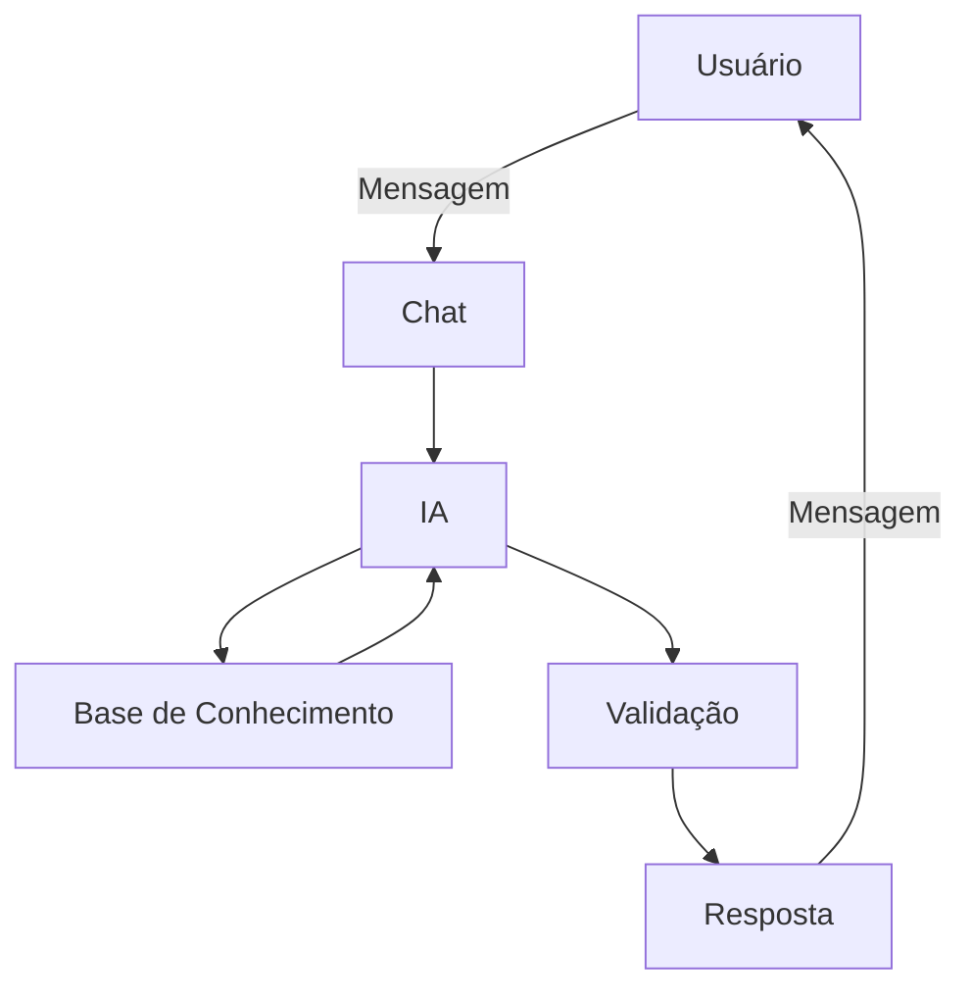

# 🤖 Edi — Agente Financeiro Inteligente

> Copiloto de IA Generativa especializado em Planejamento de Longo Prazo, Estruturação de Aposentadoria e Independência Financeira.

Este repositório contém o desenvolvimento completo do **Edi**, o agente financeiro inteligente da **EDIT — Educação Digital e Inteligência Tecnológica**, criado como solução para o desafio *"Agente Financeiro Inteligente com IA Generativa"* da Digital Innovation One (DIO).

Diferente de um chatbot reativo, o Edi foi desenhado para **antecipar** desvios no plano financeiro do usuário, **personalizar** orientações com base no perfil de investidor e **educar** sem nunca recomendar ativos específicos — sempre com foco absoluto em segurança e ausência de alucinações.

---

## 📌 O Problema

Profissionais liberais, autônomos e empreendedores digitais de 30 a 50 anos costumam ter capacidade de poupança, mas não têm tempo nem conhecimento técnico para planejar o próprio futuro financeiro. O resultado é a ansiedade de depender do INSS e o medo de não conseguir manter o padrão de vida na aposentadoria.

## 💡 A Solução

O Edi atua como um **copiloto proativo**: monitora hábitos de consumo, constância de aportes e desvios de alocação de carteira para emitir alertas *antes* que o plano de aposentadoria seja prejudicado — em vez de apenas responder ao que é perguntado.

---

## 🧠 Persona

| | |
|---|---|
| **Nome** | Edi (Assistente da EDIT) |
| **Personalidade** | Educado, paciente, didático — nunca julga os gastos do cliente |
| **Tom de voz** | Informal, acessível, como um professor particular; sem "financês" corporativo |
| **Especialidade** | Aposentadoria e independência financeira de longo prazo |
| **Fora do escopo** | Day trade, criptomoedas especulativas, recomendação nominal de ativos, suporte cotidiano (boletos, apps de terceiros) |

Exemplos de linguagem do agente:
- *Saudação:* "Olá! Tudo bem? Estou pronto para ajudar com seu futuro. Vamos começar?"
- *Erro/Limitação:* "Não consigo te ajudar com essa informação agora, vamos experimentar algo mais focado no seu futuro..."

---

## 🏗️ Arquitetura



| Componente | Tecnologia |
|---|---|
| Interface | [Streamlit](https://streamlit.io/) |
| LLM | Ollama (execução local) |
| Base de Conhecimento | Arquivos JSON/CSV com dados do cliente |
| Validação | Checagem de alucinações antes da resposta final |

---

## 🔐 Segurança e Anti-Alucinação

O system prompt do Edi impõe regras rígidas:

- ✅ Só usa dados fornecidos no contexto
- ✅ Nunca inventa taxas, rentabilidades ou dados históricos
- ✅ Admite quando não sabe algo
- ✅ Não recomenda investimentos específicos — apenas educa sobre classes de ativos
- ✅ Não acessa contas pessoais (e-mails, bancos) nem dados de terceiros
- ✅ Não substitui profissionais da área

O [system prompt completo](docs/03-prompts.md) inclui cenários de interação (alerta de desvio de orçamento, otimização fiscal com PGBL) e tratamento explícito de *edge cases*: perguntas fora de escopo, tentativas de obter dados sensíveis de terceiros, pedidos de recomendação sem contexto e propostas de especulação de curto prazo.

---

## 📊 Base de Conhecimento

Os dados mockados da pasta [`data/`](data) alimentam o agente:

| Arquivo | Formato | Uso no agente |
|---|---|---|
| `historico_atendimento.csv` | CSV | Contextualizar interações anteriores |
| `perfil_investidor.json` | JSON | Personalizar as conversas com o usuário |
| `produtos_financeiros.json` | JSON | Apresentar produtos disponíveis ao perfil do cliente |
| `transacoes.csv` | CSV | Analisar padrão de gastos |

> Adaptação feita nos dados originais do desafio: o produto **Fundo Imobiliário (FII)** substituiu o **Fundo Multimercado**.

Carregamento dos dados (Python):

```python
import pandas as pd
import json

perfil = json.load(open('./data/perfil_investidor.json'))
transacoes = pd.read_csv('./data/transacoes.csv')
historico = pd.read_csv('./data/historico_atendimento.csv')
produtos = json.load(open('./data/produtos_financeiros.json'))
```

---

## 📈 Avaliação e Métricas

O agente foi testado com cenários estruturados nas dimensões de **assertividade**, **segurança anti-alucinação** e **coerência** com o perfil do cliente.

| Teste | Resultado |
|---|---|
| Consulta de gastos ("Quanto gastei com alimentação?") | ✅ Correto após reformulação (alucinou na 1ª tentativa e se corrigiu) |
| Recomendação de produto conservador | ✅ Correto (indicou Tesouro Selic com justificativa) |
| Pergunta fora do escopo ("previsão do tempo") | ✅ Correto — recusou e redirecionou |
| Produto inexistente na base | ✅ Correto — admitiu não ter a informação |

**Principais aprendizados:** as respostas respeitaram os parâmetros de segurança definidos no system prompt, mas ainda estão longas demais — um ponto de ajuste para próximas iterações.

Detalhes completos em [`docs/04-metricas.md`](docs/04-metricas.md).

---

## 📁 Estrutura do Repositório

```
📁 dio-lab-bia-do-futuro/
│
├── 📄 README.md
│
├── 📁 data/                          # Dados mockados que alimentam o Edi
│   ├── historico_atendimento.csv
│   ├── perfil_investidor.json
│   ├── produtos_financeiros.json
│   └── transacoes.csv
│
├── 📁 docs/                          # Documentação completa do agente
│   ├── 01-documentacao-agente.md     # Caso de uso, persona e arquitetura
│   ├── 02-base-conhecimento.md       # Estratégia de dados
│   ├── 03-prompts.md                 # System prompt, exemplos e edge cases
│   ├── 04-metricas.md                # Testes e resultados de avaliação
│   └── 05-pitch.md                   # Roteiro do pitch
│
├── 📁 src/                           # Aplicação (Streamlit + Ollama)
│
├── 📁 assets/                        # Imagens e diagramas
│
└── 📁 examples/                      # Referências de implementação
```

---

## 🚀 Como Executar

1. Clone o repositório e instale as dependências (Streamlit, pandas):
   ```bash
   pip install streamlit pandas
   ```
2. Tenha o [Ollama](https://ollama.ai/) instalado e com um modelo baixado localmente.
3. Rode a aplicação:
   ```bash
   streamlit run src/app.py
   ```

---

## 🛠️ Ferramentas Utilizadas

| Categoria | Ferramenta |
|---|---|
| LLM | Ollama (local) |
| Interface | Streamlit |
| Diagramas | Mermaid |

---

## 🎯 Diferencial

O Edi não espera o usuário errar — ele monitora, alerta e propõe rotas de correção antes que o desvio comprometa a meta de aposentadoria, sempre em linguagem simples e sem nunca ultrapassar o limite entre educar e recomendar.

---

Projeto desenvolvido por **Alexandre Carvalho** ([EDIT — Educação Digital e Inteligência Tecnológica](https://github.com/aleccarval)) como parte do lab *"Agente Financeiro Inteligente com IA Generativa"* da [Digital Innovation One](https://github.com/digitalinnovationone/dio-lab-bia-do-futuro).
