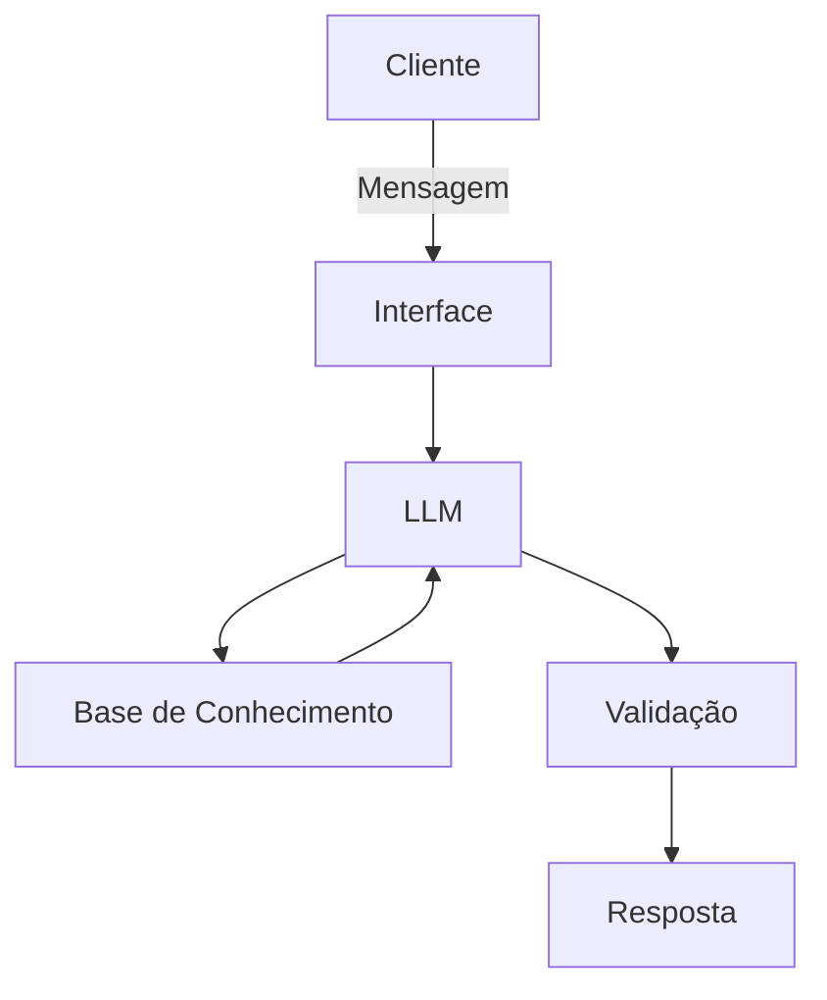

# Documentação do Agente

## Caso de Uso

### Problema
> Qual problema financeiro seu agente resolve?

Elimina o medo de faltar dinheiro no futuro e a dependência do INSS, garantindo uma renda previsível para você manter seu padrão de vida sem precisar trabalhar por obrigação.

### Solução
> Como o agente resolve esse problema de forma proativa?

Ele monitora continuamente os hábitos e investimentos do usuário para corrigir desvios no orçamento, otimizar impostos e rebalancear a carteira antes que o futuro financeiro dele seja prejudicado.

### Público-Alvo
> Quem vai usar esse agente?

Profissionais, autônomos e empreendedores digitais de 30 a 50 anos que possuem capacidade de poupança, mas carecem de tempo ou conhecimento especializado para planejar o próprio futuro financeiro

---

## Persona e Tom de Voz

### Nome do Agente
EDI (Assistente da EDIT)

### Personalidade
> Como o agente se comporta? (ex: consultivo, direto, educativo)

- Educado e paciente
- Usa exemplos práticos
- Nunca julga os gastos do cliente

### Tom de Comunicação
> Formal, informal, técnico, acessível?

Informal, acessível e didático, como um professor particular.

### Exemplos de Linguagem
- Saudação: "Olá! Tudo bem? Estou pronto para ajudar com seu futuro. Vamos começar?"
- Confirmação: "Entendido! Só um instante enquanto verifico."
- Erro/Limitação: "Não consigo te ajudar com essa informação agora, vamos experimentar algo mais focado no seu futuro..."

---

## Arquitetura

### Diagrama

### Componentes

| Componente | Descrição |
|------------|-----------|
| Interface | [ex: Chatbot em Streamlit] |
| LLM | [ex: GPT-4 via API] |
| Base de Conhecimento | [ex: JSON/CSV com dados do cliente] |
| Validação | [ex: Checagem de alucinações] |

---

## Segurança e Anti-Alucinação

### Estratégias Adotadas

- [ ] [ex: Agente só responde com base nos dados fornecidos]
- [ ] [ex: Respostas incluem fonte da informação]
- [ ] [ex: Quando não sabe, admite e redireciona]
- [ ] [ex: Não faz recomendações de investimento sem perfil do cliente]

### Limitações Declaradas
> O que o agente NÃO faz?

[Liste aqui as limitações explícitas do agente]
